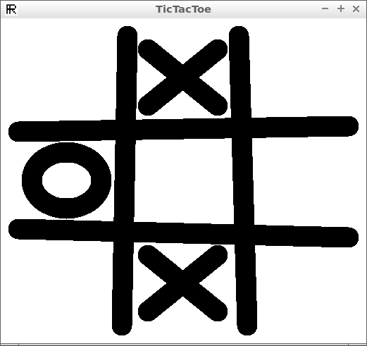

# TicTacToe

Branch   |[GitHub Actions](https://github.com/richelbilderbeek/TicTacToe/actions)                                  |                                                                                |
---------|---------------------------------------------------------------------------------------------------------|----------------------------------------------------------------------------------------------------------------------------------------|----------------------------------------------------------------------------------------------------------------------------------------------------------------------------------------------------------
`master` | | |
`develop`|||

C++ tic-tac-toe game.

## External links

 * [Richel Bilderbeek's games](https://github.com/richelbilderbeek/Games)
